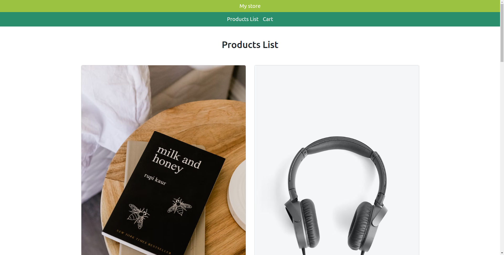
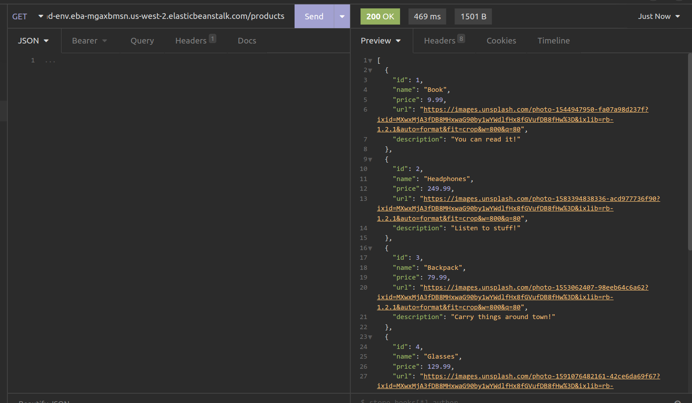
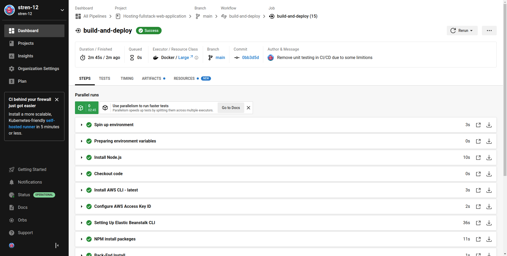

# Hosting a Full Stack Application
## About The Project
This project is A FullStack Web Application with CI/CD and Automated deployment in AWS EC2 (By using AWS EB for Back-End) and AWS S3 for Front-End

### Built With
- TypeScript as programming language
- NodeJS 16 as runtime environment
- Express JS as Backe-End framework
- Angular as Front-End framework
- Jasmine For Back-End Unit testing
- AWS Simple Storage Service (S3) for Front-End static files hosting 
- AWS Elastic Compute Cloud (EC2) for Back-End computing 
- AWS Elastic Beanstalk (EB) as orchestration service

## Application overview
The Front-End is accessible by http://frontend-bucket-1234.s3-website-us-west-2.amazonaws.com/
 
The Back-End is hosted at http://awsbackend-env.eba-mgaxbmsn.us-west-2.elasticbeanstalk.com/  
Note that the Front-End Actually Uses the Back-End to fetch data 
## Screenshots

### Front-End 

### Back-End 

### CI / CD

