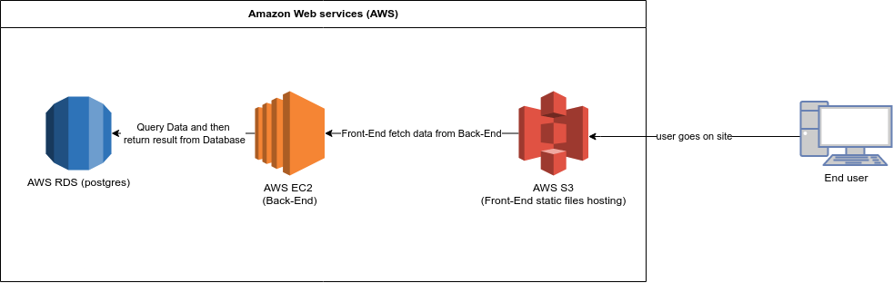
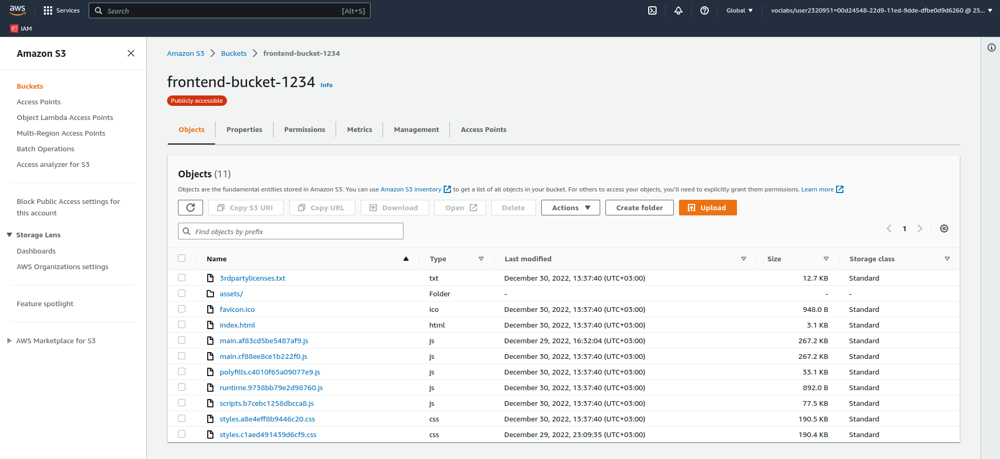
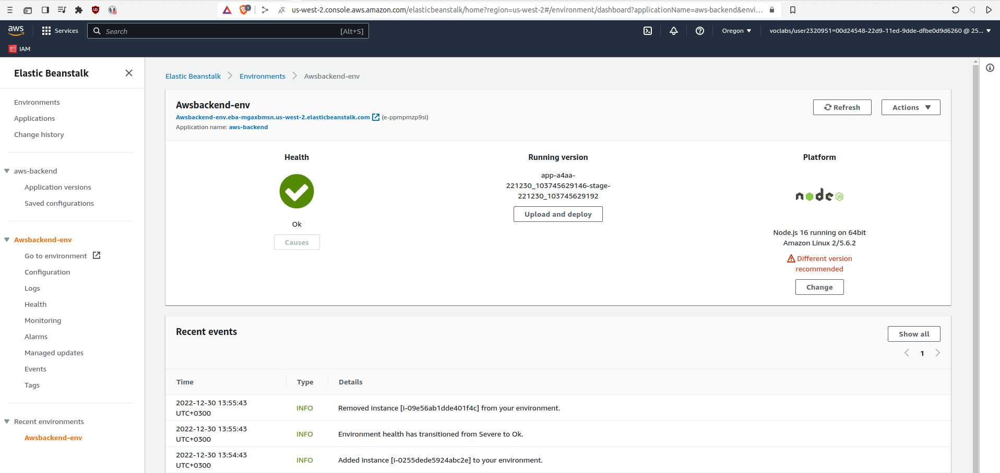
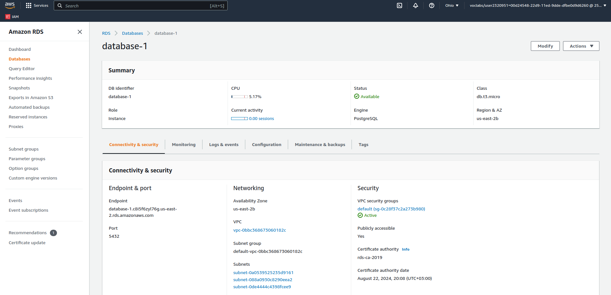

# Infrastructure Description
This document describe the application infrastructure in detail


## Front-End 
We use AWS S3 bucket to host the static Front-End files (i.e HTML, CSS, JS) and to be able to automate the deployment process by using AWS CLI command below 
```sh
aws s3 cp --recursive --acl public-read ./dist s3://$bucket/
```
Where $bucket is environment variable contain the bucket name
But for deployment use command
```js
npm run frontend:build && npm run frontend:deploy
```



### Back-End
For Back-End we use AWS EC2, By using AWS EB service we can automate the setup and deployment for new version of the application. <br>
To Deploy new verison of the Back-end we issues command:
```js
npm run backend:deploy
```
Unlike Front-End this command include building for compatabliy reasons where Front-End Build will work at *ANY* browser unlike TypeScript Build (just to be in the safe side may be this is overkill)



### Database
For Database we use AWS RDS (postgres) to store data as required in the project Overview. <br>
The Back-End will query data and DataBase will return the result 


