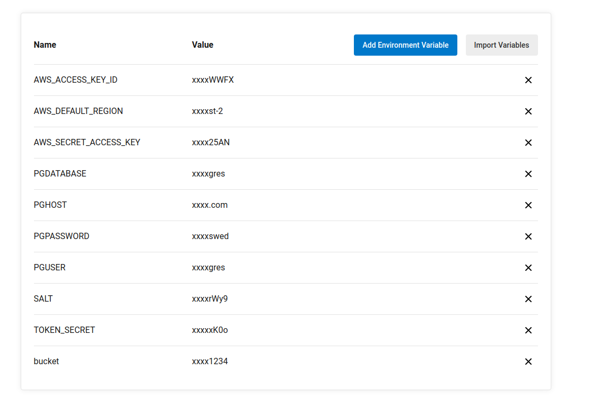
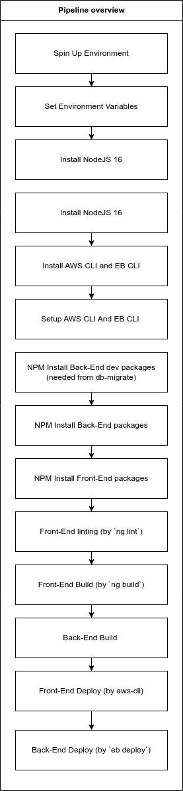

# Pipeline Description
This document describe the pipeline stages in detail

### Spin Up Environment
*This is done By CircleCI*  
It's the process of seting up the basic environment only

### Set Environment Variables
*This is done By CircleCI*  
For later stages we need  Environment Variables for Deployment  

### Install NodeJS 16
*This is done By CircleCI*  
CircleCI will install the NodeJS for us in this stage 

### Install AWS CLI and EB CLI
*This is done By CircleCI*  
CircleCI will instal both AWS CLI and EB CLI to be used later in deployment

### Setup AWS CLI And EB CLI 
*This is done By CircleCI*  
After installing the AWS CLI and EB CLI CircleCI will setup them up for us to use (by using Environment Variables)

### NPM Install Back-End dev packages
For Building later we need to instsal some development dependencies (db-migrate and postgres driver for db-migrate) Note that this is diffrent from the next stage

### NPM Install Back-End packages
Now we will install the production packages like ExpressJS

### NPM Install Front-End packages
We will install the Front-End packages here like @angular/core to be used later for building 

### Front-End linting
By using `ng lint` we will lint the Front-End and make it ready to build

### Front-End Build
By using `ng build` we will build the Front-End and make it ready to be deployed

### Back-End Build 
In this stage we will build the Back-End 

### Front-End Deploy
With help of AWS CLI we deploy the Front-End build to the AWS S3 bucket 

### Back-End Deploy
With the command `eb deploy` we will deploy the Back-End to our AWS EC2, thankfuly the AWS EB setup the EC2 instance for us

## Pipeline Diagram

